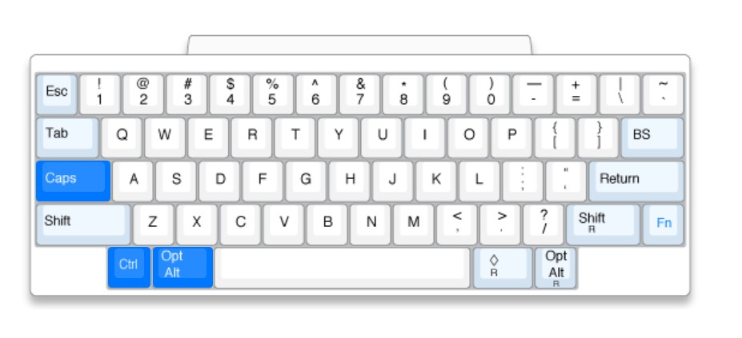

# CapslockMagic

 > [中文文档](https://miozus.github.io/CapslockMagic) | [README](https://miozus.github.io/CapslockMagic/#/en-us/) | [Karabiner Gallery](https://ke-complex-modifications.pqrs.org/#caps_lock_magic) | [Github Repo](https://github.com/miozus/CapslockMagic) | [Gitee Repo](https://gitee.com/miozus/CapslockMagic)
 >
 >   

Capslock Magic 是一套**跨平台**、**跨应用**的键映射解决方案。 它将 ⇪ CapsLock（大写锁定键）改造为一个强力的功能修饰键（✱ Hyper ），还改造了 <kbd>3</kbd> <kbd>4</kbd> <kbd>;</kbd> 按键，适用各种日常业务场景。奇迹般地提高操作效率与生产力。

 —— [示例](https://miozus.github.io/CapslockMagic/#/zh-cn/monkey-ime) —— [安装](https://miozus.github.io/CapslockMagic/#/zh-cn/quick-start-windows) —— [使用](https://miozus.github.io/CapslockMagic/#/zh-cn/capslock-enhancement) —— [问题](https://miozus.github.io/CapslockMagic/#/zh-cn/capslock-enhancement) —— 

## 功能一览

| &nbsp;  |       |    |  |  |
|----| ------------ | ---------- | ---- | ---- |
| 底层 |💻  支持 Win/Mac   |  ⌨️  键盘配列 60   |  🧰  JavaScprit 风格   |  ⚙️  配置自定义   | 
| 基础 | 👾  [启动程序](https://miozus.github.io/CapslockMagic/#/zh-cn/capslock-enhancement)   |  📺  [窗口管理](https://miozus.github.io/CapslockMagic/#/zh-cn/window)   |  🖱️  [鼠标操作](https://miozus.github.io/CapslockMagic/#/zh-cn/mouse)   |  `I`  [光标编辑](https://miozus.github.io/CapslockMagic/#/zh-cn/capslock-enhancement)  |
| 进化 |🐵  [猴子输入法](https://miozus.github.io/CapslockMagic/#/zh-cn/monkey-ime) |  `;`  [分号特殊符](https://miozus.github.io/CapslockMagic/#/zh-cn/semicolon-hook) |  3️⃣  [数字小键盘](https://miozus.github.io/CapslockMagic/#/zh-cn/numpad) |  🤖  [中英文管家](https://miozus.github.io/CapslockMagic/#/zh-cn/ime-manager) |  🦉  [单手调试器](https://miozus.github.io/CapslockMagic/#/zh-cn/debugger) | 
| 进化 | 🦑  [宇宙编辑器](https://miozus.github.io/CapslockMagic/#/zh-cn/universe-editor) | 
