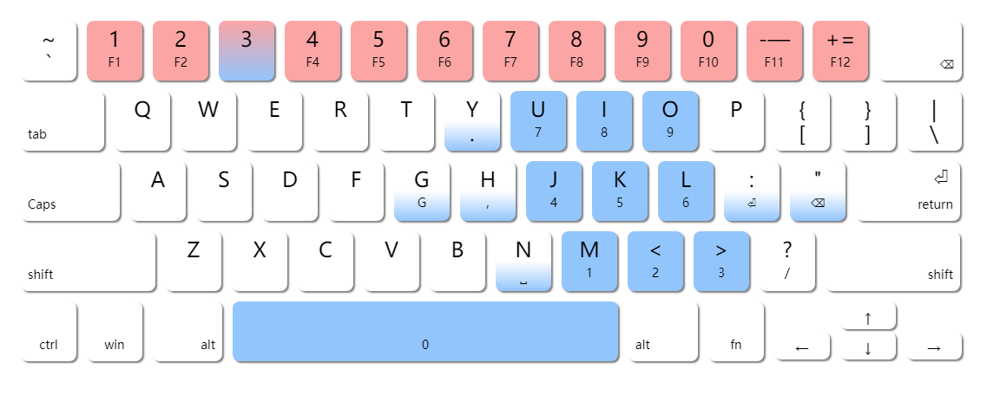
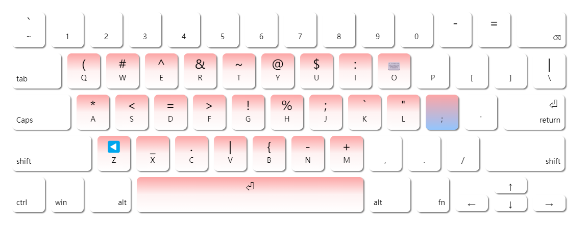
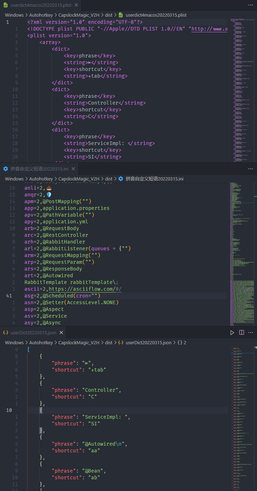
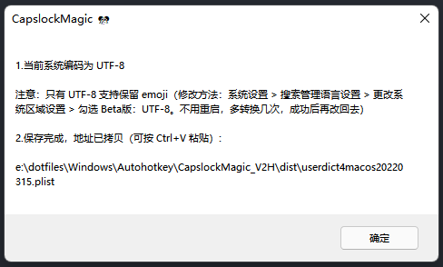
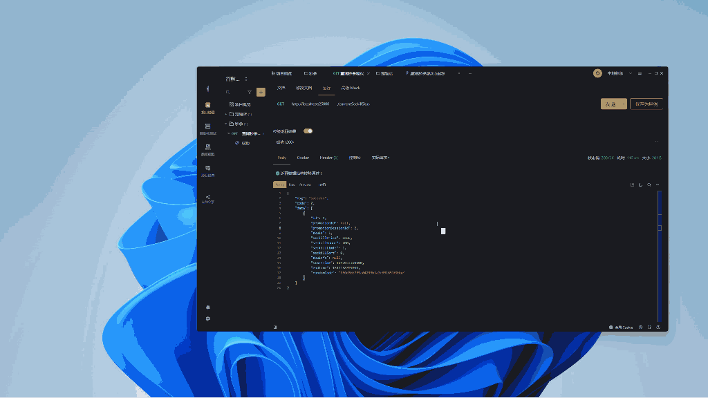
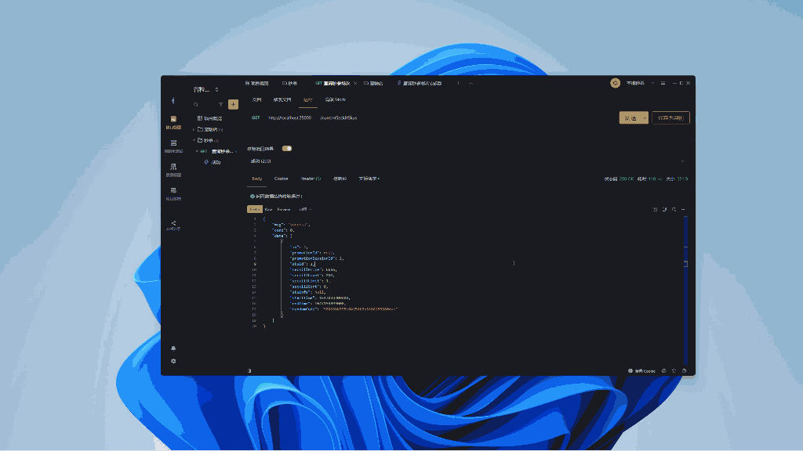
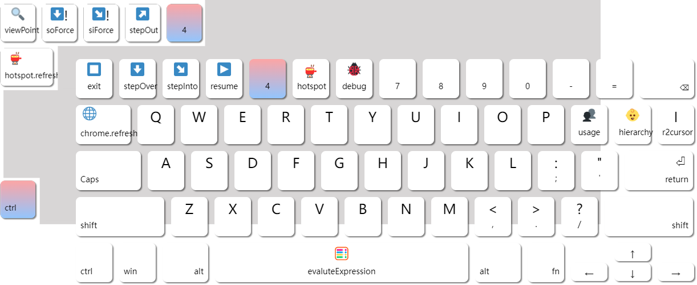

# CapslockMagic

> [中文文档](https://github.com/miozus/CapslockMagic) | [README](https://translate.google.cn/) | [Karabiner Gallery](https://ke-complex-modifications.pqrs.org/#caps_lock_magic) | [Github Repo](https://github.com/miozus/CapslockMagic) | [Gitee Repo](https://gitee.com/miozus/CapslockMagic)
>
> Make Capslock Great Three!
> 
> <a href="https://github.com/thqby/AutoHotkey_H"> </a> <a href="https://github.com/miozus/CapslockMagic"> </a> <a href="https://jq.qq.com/?_wv=1027&k=iiuN83v3"> </a>

* 1. [Quick Start](#QuickStart)
	* 1.1. [Windows](#Windows)
	* 1.2. [MacOS](#MacOS)
		* 1.2.1. [import from cloud](#importfromcloud)
* 2. [Usage](#Usage)
	* 2.1. [3️⃣ Digital Keyboard](#DigitalKeyboard)
	* 2.2. [<kbd>;</kbd> Semicolon Keyboard](#kbdkbdSemicolonKeyboard)
	* 2.3. [⌨️ Monkey IME](#MonkeyIME)
	* 2.4. [📺 Window Movement](#WindowMovement)
	* 2.5. [📺 Window Zoom & Position](#WindowZoomPosition)
	* 2.6. [🖱️ Mouse Controller](#MouseController)
* 3. [Programmer Episode](#ProgrammerEpisode)
	* 3.1. [🦉 V1.2.0 One-handed Debugger](#V1.2.0One-handedDebugger)
	* 3.2. [🦑 V1.3.0 Universe Code Editor](#V1.3.0UniverseCodeEditor)
	* 3.3. [ ️🕶️ v1.5.0 HHKB兼容适配](#v1.5.0HHKB)
* 4. [1分钟学会添加一个猴子词条](#)
* 5. [进化史](#-1)
* 6. [五个人性化设计](#-1)
* 7. [常见问题](#-1)

---

##  1. <a name='QuickStart'></a>Quick Start

###  1.1. <a name='Windows'></a>Windows

1.Download

```bash
git clone https://github.com/miozus/CapslockMagic.git
```

2.run

1. unzip: `tools/AutoHotkey_H/AutoHotkey_H-xx-thqby.7z`
   , or go to [thqby/AutoHotkey_H](https://github.com/thqby/AutoHotkey_H/releases) releases page to download. 
2. authorize administrator privileges: Right click `AutoHotKey.exe` （x64 / x32）> Property > Security > Compatible > Administrator > Sure。
3. set default open method: right click `CapslockMagic.ahk` , Open-method, choose the program called `AutoHotKey.exe` which step 1 used。

<details>
<summary> 【recommend】auto startup</summary>
&nbsp;

创建基本任务：按 <kbd>Win</kbd> 键搜索 `task` > 任务计划程序 > 右键单击任务计划程序库，新建文件夹 > 新建基本任务 > (按引导设置) > 完成

- 常规：必选使用最高权限运行
- 触发器：登陆时
- 条件：取消勾选所有
- 操作：启动程序 `AutoHotKey.exe`, 参数 `CapslockMagic.ahk` 文件地址


</details>

<details>
<summary>【optional】quick launch tip</summary>
&nbsp;

1. 新建文件夹 `myenv` 
2. 右键点击`CapslockMagic.ahk` 创建快捷方式，剪切放入 `myenv` 文件夹中（重命名为`m`）
3. 将 `myenv` 文件夹完整路径，添加到系统环境变量 PATH。
4. 即实现 <kbd> Win</kbd> + <kbd>E</kbd> 输入 `m` 回车，瞬间启动。


</details>

###  1.2. <a name='MacOS'></a>MacOS

####  1.2.1. <a name='importfromcloud'></a>import from cloud

copy and open the url by `Safari`, which would load setting into  `Karabiner-Element` automatically, then open it, choose tag `complex-mapping`  >
 `add-rule` (left-below) > choose setting  > `Enable` 。

```bash
karabiner://karabiner/assets/complex_modifications/import?url=https://raw.githubusercontent.com/miozus/CapslockMagic/master/tools/karabiner/caps_lock_magic.json
```

> **Notice**： please download   [Karabiner-Element](https://karabiner-elements.pqrs.org/) first, which is free and open-source. CapsLockMagic support plugins below：
> 
> - `Semicolon Pull Down Symbol`
> - `3 Awake Digital Keyboard`
> - the other function, please go to  [Vonng/Capslock](https://github.com/Vonng/Capslock) , import as needed。

<details>
<summary>【optional】import from official karabiner website</summary>
&nbsp;

```bash
https://ke-complex-modifications.pqrs.org/#caps_lock_magic
```

</details>

<details>
<summary>【optional】import from here by custom </summary>
&nbsp;

1. download

  ```bash
  git clone https://github.com/miozus/CapslockMagic.git
  ```

2. modify `tools/karabiner/caps_lock_magic.yml`
3. run terminal command `yq` ，transform yaml ⇒ json , then put it into default config content on MacOS.
 - run `brew install yq` first if downloaded not yet

```bash
yq eval -j -I=2 your_path_to_CapslockMagic/tools/karabiner/caps_lock_magic.yml > ~/.config/karabiner/assets/complex_modifications/caps_lock_magic.json
```

4 open `Karabiner-Elements`, add rules, enable setting.


</details>

##  2. <a name='Usage'></a>Usage

Make ⇪CapsLock a stronger function modify key(✱ Hyper), improve productive and efficiency incredibly.


Most keymapping extends [CapsLock-Enhancement](https://github.com/Vonng/Capslock/tree/master/docs/zh-cn) , press those combination which you interest. Now I will introduce the evolutionary function of `Magic`：

###  2.1. <a name='DigitalKeyboard'></a>3️⃣ Digital Keyboard

Hold on <kbd>3</kbd> into digital state, as while press gently <kbd>SecondKey</kbd>, whose output perform the relative key below. release <kbd>3</kbd> would exit digital state。



| input                        | output                 |
|------------------------------|------------------------|
| <kbd>3</kbd> + <kbd>2</kbd>  | <kbd>F2</kbd>          |
| <kbd>3</kbd> + <kbd>J</kbd>  | <kbd>4</kbd>           |
| <kbd>3</kbd> + <kbd>N</kbd>  | <kbd>␣</kbd>           |
| <kbd>3</kbd> + <kbd>G</kbd>  | <kbd>G</kbd>（Vim jump） |
| <kbd>3</kbd> + NULL（release）| <kbd>3</kbd>          |

- remember easily: imagine the digital keyboard which is banked slightly, compared with the usual one.
- applicable scene: phone, check-code, position, code line. ensure or cancel also been included.

<details>
<summary>Digital keyboard design (expand) </summary>
&nbsp;

- 取消了映射到 <kbd>F3</kbd> 的按键，因为 <kbd>F3</kbd> 为了成全整个模式，牺牲了它自己。

- 把 <kbd>F1~12</kbd> 加上， 是因为他们都和数字有关，而且我的 60 配列键盘 `fn2` 键在右下角对称 `Ctrl` 键， 单个键要瞟一眼键盘，再整组合键的话，手指太扭曲了。

</details>

###  2.2. <a name='kbdkbdSemicolonKeyboard'></a><kbd>;</kbd> Semicolon Keyboard

Hold <kbd>;</kbd> **and do not release**, start "Semicolon Keyboard State", as the same time, press <kbd>second key</kbd>, it would remap the symbol key up on the keystore. exit if release <kbd>;</kbd>.




- example <kbd>;</kbd> + <kbd>a</kbd> output <kbd>*</kbd>

<details>
<summary>semicolon design (expand)</summary>
&nbsp;

这样排布设计来自咸鱼阿康， 我们都用 Vim，所以本人优化的方向，也在于提升 Vim 体验:

1. 元素定位

- <kbd>H</kbd> `%` 定位括号：修改函数参数。
- <kbd>J</kbd> `;` 定位上个操作位置，使用频繁高。
- <kbd>K</kbd> `` ` `` 反引号常用来写文档，引用代码。
- <kbd>L</kbd> `"` 定位字符串，天天见。因为占用了分号键，就让邻居顺便补偿给它。
- <kbd>E</kbd> `^` <kbd>U</kbd> `$` 定位语句开头/末尾，注意观察数字键上 Vim
  和正则表达式，对于前后的按键刚好反过来。这太反人类了!因为这个设定折磨我太久，所以使用分号模式时仿佛看到沙漠绿洲。
- <kbd>B</kbd> `{` 定位大括号内，bracket 原生操作大小括号，放在一起。 <kbd>;</kbd> <kbd>shift</kbd> <kbd>B</kbd> = `)`
- <kbd>Q</kbd> `(` 定位小括号内  <kbd>;</kbd> <kbd>shift</kbd> <kbd>Q</kbd> = `}`
- <kbd>Y</kbd> `@` 执行宏，小技巧常用 `qq` 开启记录，左右搭配。也不至于误触。

2. 游戏见闻

- <kbd>N</kbd> `-` <kbd>M</kbd> `+` 我玩游戏发现的，物品计数器左边小右边大，符合直觉。
- <kbd>S</kbd> <kbd>E</kbd> <kbd>D</kbd> <kbd>F</kbd> 看上去正好像方向键 `<` `^` `>`
  左手刚好放在热键区。我思考过，游戏中左手默认方向键 <kbd>W</kbd> <kbd>A</kbd> <kbd>S</kbd> <kbd>D</kbd>
  是因为小拇指可以方便按修饰键，太浪费了。

3. 单词缩写

- <kbd>V</kbd> `|` Vertical 垂直线，V 字母从中间对称分开，V 键大概在键盘的中央（<kbd>;</kbd> <kbd>shift</kbd> <kbd>V</kbd>
  组合键映射为中文顿号 `、` ）。
- <kbd>T</kbd> `~` Tide 波浪线（<kbd>;</kbd> <kbd>shift</kbd> <kbd>T</kbd> 组合键映射为 4 个空格）。
- <kbd>C</kbd> `.` comma / dot / period 点。这里按两个键映射一个键的原因，一是可用脚本保证必须输出英文字符，不受中文句号影响；二是
  JQ 元素定位类语法 `$.` 的连击。
- <kbd>X</kbd> `_` Xia Hua Xian 下划线。
- <kbd>G</kbd> `!` Gan Tan Hao 感叹号。
- <kbd>D</kbd> `=` Deng Hao 等号。

4. 常用操作

- <kbd>Z</kbd> 撤销操作：如果打错字或误删，撤销就好了。
- <kbd>O</kbd> 切换输入法：能不用手掌按 <kbd>Ctrl</kbd> 键，就不要去按了，让双手保持在热键区。

</details>

###  2.3. <a name='MonkeyIME'></a>⌨️ Monkey IME

Press <kbd>;</kbd> **and release now**, start "Monkey Input Method Editor State", script would listen all the input of keyboard. 

- If match the right abbr, output string snippets or run function you defined.
- else exit the state immediately. press <kbd>⏎</kbd> / <kbd>Esc</kbd> / <kbd>␣</kbd> to exit, also works.


| input                                                           | display | output explanation                       | monkey      | IME State |
|-----------------------------------------------------------------|---------|------------------------------------------|-------------|-----------|
| <kbd>;</kbd>(press)                                             | 🙈      | waiting                                  | blindfolded | enter     |
| <kbd>c</kbd> <kbd>n</kbd> <kbd>e</kbd>                       | cn      | match monkey abbr(string snippets 1️ )   |             | exit      |
| <kbd>c</kbd> <kbd>n</kbd> <kbd>k</kbd>                       | cnk     | not match yet, waiting                   |             | waiting   |
| <kbd>⏎</kbd> / <kbd>Esc</kbd> / <kbd>␣</kbd>                    | 💨      | match failed (travese all / interupt)    | run away    | exit      |
| <kbd>s</kbd><kbd>l</kbd><kbd>e</kbd><kbd>e</kbd><kbd>p</kbd> | slee    | match monkey abbr(function snippets 2️⃣） |             |
|                                                                 | 🙉 睡眠   | computer sleeps soon                     | guess right | exit      |

> This is Windows **Unique** plugin，all abbr saved in `/data/UserDictionary.ahk`.

<details>
<summary>Monkey IME design note</summary>
&nbsp;

它的本质是map字典映射

- key：自定义的缩写，怎么好记怎么来。
- value: 指令集，主要分为两类
    - 1️⃣ **`xxDictionary` 字符片段词典:**。其他所有的变量 都是这类纯文本（支持换行和缩进），邮箱，网址，emoji 等。
    - 2️⃣ **`secretDictionary` 函数指令词典**。它代表用户定义的一系列 AHK 指令集的可执行函数。
        - 这里设计为必须写注释，不写不生效。
            - 比如添加一行 `"sleep", "睡眠",`
            - 还要在 `bin\SemicolonHook.ahk` 的`execSemicolonAbbr` 方法中添加一种情况 `case "sleep": computerGoSleep()`
        - 技巧：它可以用来写 Vim 的宏，完美的跨软件运行方案。

MacOS 仅将用户词典添加到内置输入法，作为打字候选项。

</details>

<details>
<summary>【example】How does Monkey IME convert abbr dictionary (.ahk) to the 3rd IME like Apple dictionary(.plist)?</summary>
&nbsp;

> 目前已支持 MacOS、QQ拼音、搜狗拼音相互转换



根据需要调用 `Converter` 类的转换方法，获得用户自定义短语文件 ，通过局域网/蓝牙/微信等方式传输，导入输入法软件即可。

1. 打开猴子词典 `./data/UserDictionary.ahk` ，在底部根据自身需要去掉注释，保存后按 <kbd>Caps</kbd> <kbd>Y</kbd> 重启脚本。

```JavaScript

;选择性注释，开放转换接口
global
macDictionary := UserDict.concat([emojiDict, csDict, privateDict, logoDict])

CapsLock & 9::
{
;猴子词典 -> 苹果词典（枚举类参数可选
MAC / PINYIN / JSON）
    Converter.convert(macDictionary, DictTypeEnum.MAC)

    ;猴子词典 < -苹果词典（弹窗选择文件）
    ;Converter.parse()

    ;猴子词典 < -苹果词典（文件目录） 
    ;fileDir := "/dist/userdict4macos.plist"
    ;Converter.parse(fileDir)

}

```

2. 按 <kbd>Caps</kbd> <kbd>9</kbd> ，根据弹窗提示操作后，点击确定，脚本所在目录就生成了文件 `/dist/userdict4macos.plist` ，通过局域网共享文件传输到 MacOS。



3. MacOS 拖拽用户词典到文本


偏好设置 > 键盘 > 文本

一般先全选删除旧词典，再将成品文件 `.plist` 拖拽进来， 导入内置中文输入法，和平时打字没有区别，只是多了候选项， 润物细无声。

没有切换输入法，也可以自动补全（但在 IDE 中却失效了）。

</details>

&nbsp;

> **<kbd>A</kbd>  Zen Mode**
>
> - enter: press key combination, enter the state of 1.5 second keyboard listening, base on the <kbd>second key</kbd>, run the function immediately.
> - exit: wait until timeout, or press <kbd>Esc</kbd> .
> 
> Notice: Windows dock pop-up and hide finally, which is normal, as release the <kbd>Win</kbd> lock.

**<kbd>A</kbd> is related to aim to window manager and mouse controller.

###  2.4. <a name='WindowMovement'></a>📺 Window Movement



Press <kbd>Caps</kbd> + <kbd>Alt</kbd> + <kbd>A</kbd> (release now) to enter zen mode:

now press <kbd>second key</kbd> gently, moving current window position.

- <kbd>H</kbd> <kbd>J</kbd> <kbd>K</kbd> <kbd>L</kbd> as left / down / up / right, like vim
- <kbd>␣</kbd> to screen center

###  2.5. <a name='WindowZoomPosition'></a>📺 Window Zoom & Position



Press <kbd>Caps</kbd> + <kbd>Ctrl</kbd> + <kbd>A</kbd> (release now) enter zen mode:

now press <kbd>second key</kbd> gently, make window position at part of the screen.

- <kbd>H</kbd> <kbd>J</kbd> <kbd>K</kbd> <kbd>L</kbd> as left / down / up / right, like vim
- <kbd>[</kbd> <kbd>]</kbd> bias left / right (2:1)
- <kbd>I</kbd> <kbd>O</kbd> bias left / right (1:1)
- <kbd>␣</kbd> center (1:1:1)
- <kbd>N</kbd> absolute center 
- <kbd>M</kbd> <kbd>,</kbd> max / min
- <kbd>.</kbd> back to last size

###  2.6. <a name='MouseController'></a>🖱️ Mouse Controller


Press <kbd>Caps</kbd> + <kbd>Win</kbd> + <kbd>A</kbd> or Monkey IME <kbd>;</kbd> `mm` ( mouse move ，release now）, enter zen mode:

now press <kbd>second key</kbd> gently, control mouse action.

- <kbd>H</kbd> <kbd>J</kbd> <kbd>K</kbd> <kbd>L</kbd> as left / down / up / right, like vim
  - while hold <kbd>A</kbd> , speed down
- <kbd>I</kbd> / <kbd>O</kbd> left / right click
- <kbd>U</kbd> / <kbd>P</kbd> forward / backward scroll
- <kbd>N</kbd> / <kbd>M</kbd> forward / backward side button
- <kbd>C</kbd> / <kbd>V</kbd> copy / paste word selected
- <kbd>G</kbd> move back to screen center

---

##  3. <a name='ProgrammerEpisode'></a>Programmer Episode

###  3.1. <a name='V1.2.0One-handedDebugger'></a>🦉 V1.2.0 One-handed Debugger 

I wrap **JetBrains Intellij Idea** keymap. Press key combination, it would activate the window of `Idea`, if exists, remap the key shot, do the related function.

- enter (optional)
    - hold <kbd>4</kbd> + <kbd>second key</kbd>
    - press <kbd>;</kbd> `dbg` 
- exit (optional)
    - active: press <kbd>Esc</kbd>
    - passive: press <kbd>A</kbd> / <kbd>I</kbd> / <kbd>O</kbd> / <kbd>S</kbd> when CRUD code, or press <kbd>␣</kbd> when open calculator.

Especially，press 3 key combination (<kbd>Ctrl</kbd>), run the enhancement of function as left-top key said in picture.



example

- press <kbd>4</kbd> + <kbd>1</kbd> , `stepOver`, program run current statement, go to next statement.
- press <kbd>4</kbd> + <kbd>3</kbd> , `resume`, program release current breakpoint, jump to the next. 
- press <kbd>4</kbd> + <kbd>5</kbd> , `hotspot` , run plugin `Jrebel` hotpot code-compiled function, equal to press the icon axe to compile.


###  3.2. <a name='V1.3.0UniverseCodeEditor'></a>🦑 V1.3.0 Universe Code Editor

Unification of the world, `vscode` + `idea` + `neovim` && `winOS` + `macOS` all use the same keymap strategy. I wrap the usual operation in integrated development environment.


通用：需添加前缀 `<leader>` （默认空格键）
global usage：press the prefix key `<leader>` (default <kbd>␣</kbd>)

- <kbd>n</kbd> next error hunt
- <kbd>j</kbd> quick fix
- <kbd>o</kbd> content
- <kbd>z</kbd> zen mode
- <kbd>f</kbd> format document
- <kbd>e</kbd> search opened files
- <kbd>a</kbd> find in projects
- <kbd>s</kbd> show current file in explorer
- <kbd>h</kbd> show history version about current file
- <kbd>b</kbd> add breakpoint
- <kbd>rr</kbd> refactor: rename

Idea episode (cause Vscode similar interface does not work)

- <kbd>g</kbd> gen code if highlight class name 
- <kbd>,</kbd> parameter move left
- <kbd>.</kbd> parameter move right
- <kbd>v</kbd> refactor: abstract variable
- <kbd>m</kbd> refactor: wrap as new function

Especially, if vim plugin installed：

- <kbd>H</kbd> go to previous tag (without prefix)
- <kbd>L</kbd> go to next tag (without prefix

Certainly, Monkey IME, <kbd>;</kbd> `**`，also record the function above,  but output related key shot. those are used about N year

使用方法：替换对应软件键位映射配置文件
usage: replace relate program config  setting

```bash
# Windows 复制粘贴到（默认/类似）位置 ->
tree .\CAPSLOCKMAGIC\TOOLS
│
├───idea
│     ├─.ideavimrc                -> IdeaVim 插件配置 -> C:\Users\<UserName>\.ideavimrc
│     └─ macOS For All Magic.xml  -> Idea 键位映射配置 -> C:\Users\<UserName>\AppData\Roaming\JetBrains\IntelliJIdea2022.1\keymaps\macOS For All Magic.xml
│
├───code
│     └─keybindings.json          -> Vscode 键位映射配置 -> C:\Users\<UserName>\AppData\Roaming\Code\User\keybindings.json
│
└───neovim
      └─init.vim                  -> Vscode/Neovim 用户配置 ->  C:\Users\<UserName>\AppData\Local\nvim\init.vim
```

<details>
<summary>宇宙编辑器增强功能按键设计（展开）</summary>
&nbsp;

1.跨平台键位映射方案增强

比如 <kbd>Shift</kbd> <kbd>F6</kbd> 代码重命名

> 源自 idea  插件（win+mac）的键位映射方案 [samvtran/jetbrains-macos-keybindings-for-all](https://github.com/samvtran/jetbrains-macos-keybindings-for-all)  : MacOS / Windows 的按键兼容。
> 
> 我将它移植到了 vscode 并微调适配。

2.Neovim 增强

比如 `<leader>rr` 代码重命名

特别地，在 Idea + Vscode 的 Neovim 插件（.ideavimrc + init.vim），对于调用编辑器动作接口，都做了统一适配。

这份配置记录了一年来，从化身八爪鱼敲键盘也无法退出 vim
的小白，到如今形成肌肉记忆的程序员，它吸收了众多设计思想：两本书，三四个开源仓库，十多个国内外视频，在各种编辑器摸爬滚打,删繁就简妥协后，获得相对平衡的结果。

3.AutoHotkey 增强

比如 <kbd>;</kbd> `lrr` 代码重命名（前面加个小写的`L`，代替 `<leader>` 键）

在插件 IDE.ahk 中的 `IdeAction` 类，封装了 1 方案的组合键。

</details>

###  3.3. <a name='v1.5.0HHKB'></a> ️🕶️ v1.5.0 HHKB兼容适配


这样改键，为了兼顾 Mac 习惯，又不失caps常用功能，从普通键盘到 HHKB 过渡自然，瞬间适应。

兼容更BT的 60 配列，按常用功能进行整合重构，移除冷门应用。

● X 插件拆分
  - 控制器：X_KB(keyboard)
  - 实现类：impl + interface + common + util


##  4. <a name=''></a>1分钟学会添加一个猴子词条

TODO: 语法嗅探、快捷短语、自定义函数，（特殊应用环境生效），集成进词条

##  5. <a name='-1'></a>进化史

`Magic` 继承了 `Capslock Enhancement` 的经典设计（类似 HHKB 键盘），弥补了它在 Windows 平台的空白。

`Magic` 吸收了 `MyKeymap` 的实现细节和设计灵感，并修复了脚本语言向上兼容，采用面向对象的现代编码风格，让开发者更容易拓展和上手维护。

`Magic` 进化了 **猴子输入法**，可以管理任意的用户指令集，获得念咒语般的魔法。

| 序号         | 功能特色   | Enhancement                                         | MyKeymap                                                      | Magic                                                             |
| ------------ | ---------- | --------------------------------------------------- | ------------------------------------------------------------- | ----------------------------------------------------------------- |
| 🌐            | Github     | [Vonng/Capslock](https://github.com/Vonng/Capslock) | [xianyukang/MyKeymap](https://github.com/xianyukang/MyKeymap) | [miozus/CapslockMagic](https://github.com/miozus/CapslockMagic)   |
| 💻            | 支持平台   | 主: MacOS </br> 次: Windows                         | 仅限 Windows11/10                                             | 主: Windows 11/10 </br> 次: MacOS                                 |
| ⌨️            | 推荐配列   | 87 键                                               | 60 键                                                         | 60 键                                                             |
| 🧰            | 开发软件   | Karabiner 单纯的字典风格                            | AutoHotkey V1 面向过程的脚本风格                              | AutoHotkey_H_V2 面向对象的现代风格，类似 JavaScript，支持多线程   |
| ⚙️            | 配置文件   | 鸿篇巨制的 json / yaml 文本                         | 内置网页服务，界面非常友好                                    | 源码即配置，拓展灵活，适合开发者                                  |
| 👾            | 启动程序   | ✅ 仅打开第一个                                      | ✅ 支持同类窗口切换                                            | ✅ 支持同类窗口切换                                                |
| 📺            | 窗口调整   | ✅ 需安装 Moom                                       | ✅ 调整位置和移动                                              | ✅ 调整位置和移动（仿写的 Moom）、支持禅模式                       |
| 🖱️            | 鼠标操作   | ✅ 需双手按住                                        | ✅ 需双手按住                                                  | ✅ 按下进入禅模式，可单手操作                                      |
| `I`          | 光标编辑   | ✅ 方向移动和前后删除                                | ✅ 需双手按住                                                  | ✅ 方向移动和前后删除                                              |
| 🐵            | 猴子输入法 | ❌                                                   | ✅ 分号模式：指令集                                            | ✅ 分号模式进阶版：用户词典、指令集等，支持词典同步 MacOS          |
| <kbd>;</kbd> | 分号特殊符 | ❌                                                   | ✅ 重排列到字母键位                                            | ✅ 重排列到字母键位（调优），支持 MacOS                            |
| 3️⃣            | 数字小键盘 | ❌                                                   | ✅ 数字模式                                                    | ✅ 数字小键盘 + <kbd>F1~12</kbd> ，支持 MacOS                      |
| 🤖            | 中英文管家 | ❌                                                   | ❌                                                             | ✅ 解决写代码又写注释的切换痛点                                    |
| 🦉            | 单手调试器 | ❌                                                   | ❌                                                             | ✅ 压缩的调试组合键（程序员特供）                                  |
| 🦑            | 宇宙编辑器 | ❌                                                   | ❌                                                             | ✅ 统一的 Idea + vscoDe 键位映射方案 + vim 增强热键 （程序员特供） |

##  6. <a name='-1'></a>五个人性化设计

🤖 **中英文管家**

优化了写代码注释的体验，让脚本托管软件对应的中英文状态以及切换。

- 开发者在各种编辑器 `VSCode`、`Intelj Idea`、`Vim` 写完注释后，按 <kbd>Caps</kbd> 可以直接返回到 `Normal` 模式。
- 如果切换到 `Notion` 写文档，默认使用中文，切回 IDE 默认变回英文。

<details>
<summary> 自动切换实现原理 </summary>
&nbsp;

- 按下 <kbd>Caps</kbd> （映射 <kbd>Esc</kbd>） 或鼠标单击时，脚本会使用图像识别，全屏检测一次 `中文输入法现在处于什么模式？`
  ，如果是中文，就切换回英文。
    - 默认微软拼音。如果用搜狗拼音，配置切换接口即可，甚至不用图像识别。
    - 特殊的中文标点符号：已内置在词典中，以备不时之需。
    - 闲鱼阿康的解决方案：推荐禁用中文输入法了。（太简单粗暴了。）
- 在中英文标点的细节上，为了避免被 InputHook 模式冲突， 特别声明了 中文标点输入 开关（chinsePunctuationHotkey），进行拦截

</details>

<details>
<summary>设计思想：下定决心忘记所有输入法的状态</summary>
&nbsp;

为你的常用程序分别设置初始状态，每次切换回来。它会默默自动初始化中文 / 英文输入法状态，然后你要做的。你只要敲键盘，忘记它的的状态。 (参考文章: [AHK 实现中英文输入法自由](https://www.jianshu.com/p/72f63e9f7c0e))

</details>

&nbsp;
📒 **内置猴子词典**

词典是全新的命名空间，本质是 Map 数据结构，作为底层支撑着猴子输入法，不会和本地输入法冲突。这是半年来积累的实践，每天都在用，打字重复三次就考虑入库，灵感式更新。如果你想重写自己的词典，它非常有参考价值。

<details>
<summary>映射键值编码规则</summary>
&nbsp;

- `小鹤双拼` 的拼音编码。比如 jxso（即全拼 jiasuo，加锁） ⇒ 🔒
    - 因为双拼能保证四个字母键，拼出两字词语，重码率低，这套规则的按键频率，分摊到手指也不累。
- 单词缩写，所读即所得。比如 acf ⇒ `@` `C`on `f` iguration

</details>

<details>
<summary>猴子词典涵盖范围</summary>
&nbsp;

- `emoji`：数据结构和算法 | 缓存 | 线程 | 设计模式 | 事务
- `cs`：计算机科学 | Spring 常用注解 | RESTful | 代码片段（如预防各种类型 NPE）
- `win`: PowerShell 终端命令
- `private`：完整中文标点符号 （无视输入法）| 按键符号
- `logo`：收集各种开发框架图标链接，装饰 Notion 标题

</details>

&nbsp;
🚫 **屏蔽热键**

屏蔽了微软 <kbd>Win</kbd> 键相关的 `一年也用不上几次但几百年都存在` 的组合键，做组合键的吝啬鬼。

🧩 **内置插件**

`Notion.ahk` 支持粘贴不同语言的代码块、调整`block`折叠或无序列表，左手删除字符，代码块语言格式；去掉粘贴文本格式等功能。

⏳ **动画计时器**

如果你网络请求，等待时间比较长，看上去像电脑死机，为什么不试试  `Timer` 动画呢？人有悲欢离合，月有阴晴圆缺。

##  7. <a name='-1'></a>常见问题

<details>
<summary> 1. 脚本可以设置开机自启吗？ </summary>
&nbsp;

可以。分两种情况。

1. 自带【管理员权限】的软件，只能【计划任务和程序】。因为一般管理员权限的软件都不能开机自启，都会面临的 PAC 问题。
  - 如果不给管理员权限，遇到有些系统软件，脚本就失效了。
  - 它需要管理员权限来控制 `sehll` ，降权打开软件（比如 VSCode）。

2. 不带【管理员权限】的软件， 将脚本的快捷方式，剪切放到开机自启的目录（ <kbd>win</kbd> + <kbd>R</kbd> 运行`shell:startup`）中即可。

</details>

<details>
<summary> 2. 脚本支持旧版的 AutoHotkey V1 吗？（脚本支持 Windows 7）吗？ </summary>
&nbsp;

`Magic` 早期也是从 V1 迭代过来，历史版本保存在 `/tools/release/AutoHotkey_V1` 目录下，可从
[AutoHotkey 官网地址](https://www.autohotkey.com/) 下载当前版本的配套软件（AutoHotkey_1.1.33.10+）直接运行。

- `magic_v1` 单机服务，简单的光标编辑等，想到什么功能就扔进去。
- `magic_v2` 拆分多个微服务，为不同的软件编写脚本，做了拆分，可见现在的雏形。

这两个版本，本人不再更新维护了，因为后面遇到了面向对象风格的版本，维护和拓展更方便。如果你在用 Windows7 ，可以参考修改，直接拿去用吧。

</details>

&nbsp;
>
> All my effort is the parody of Ruohang Feng (@Vonng) &amp; Salted Fish Akang (@xianyukang).
>
> 我所有的努力都是对冯若航和咸鱼阿康的拙劣模仿。
