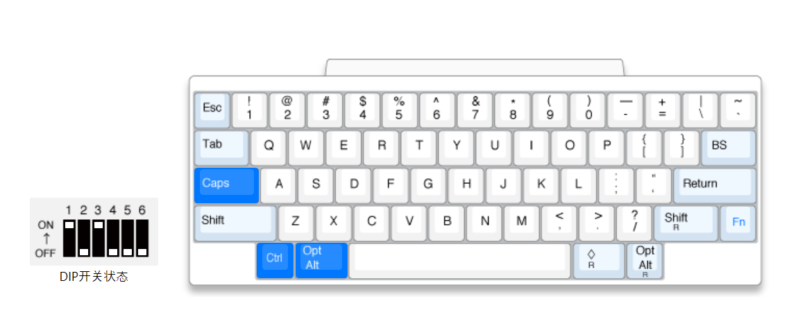

#  ️🕶️ v1.5.0 HHKB兼容适配

这样改键，为了兼顾 Mac 习惯，又不失caps常用功能，从普通键盘到 HHKB 过渡自然，瞬间适应。

兼容更BT的 60 配列，按常用功能进行整合重构

* X 插件拆分
  - 控制器：X_KB(keyboard)
  - 实现类：impl + interface + common + util

* 移除冷门应用: [爬虫零件箱](https://github.com/miozus/SpiderToolbox) (拆分出去的项目)。

* 增加按键转换注册表脚本，修改映射左侧两键 <kbd>Alt</kbd> <-> <kbd>Ctrl</kbd>

* 修复：检测图片太慢而导致500ms，在 IDE 环境异步进程 200ms 后，自动将设置为英文

