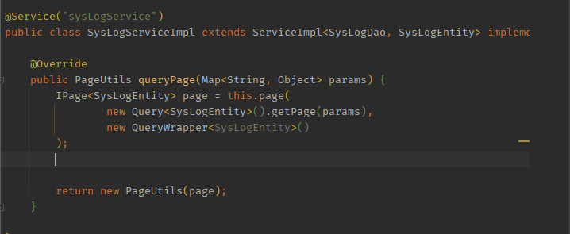

# ⌨️ 猴子输入法

按下分号 <kbd>;</kbd> **立即松手**（即轻按），进入“猴子输入法”状态，此时监听键盘，输入正确的密令，输出字符片段（纯文本），或执行自定义的函数指令。

如果输入错误密令或按下 <kbd>Esc</kbd> 等，立即退出。

关键词：**跨应用**!无论处在什么程序，都生效的魔法。

&nbsp;

| 输入                                                              | 显示   | 输出说明                                       | 猴子   | 输入法状态 |
| ----------------------------------------------------------------- | ------ | ---------------------------------------------- | ------ | ---------- |
| <kbd>;</kbd>（轻按）                                              | 🙈      | 等待输入密令                                   | 不看   | 进入       |
| 假如 <kbd>c</kbd> <kbd>n</kbd> <kbd>e</kbd>                       | cn     | 匹配到猴子词典（字符片段 1️⃣），输出纯文本 |        | 退出       |
| 假如 <kbd>c</kbd> <kbd>n</kbd> <kbd>k</kbd>                       | cnk    | 尚未匹配，继续等待                             |        | 等待       |
| <kbd>⏎</kbd> 或 <kbd>Esc</kbd> 或 <kbd>␣</kbd>                    | 💨      | 截至目前未匹配成功，中断                       | 跑了   | 退出       |
| 假如 <kbd>s</kbd><kbd>l</kbd><kbd>e</kbd><kbd>e</kbd><kbd>p</kbd> | slee   | 匹配到猴子词典（函数指令 2️⃣），执行自定义函数功能           |        |
|                                                                   | 🙉 睡眠 | 电脑马上进入休眠状态                           | 猜对了 | 退出       |

> 这是 Windows **独占**功能，词条数据保存在 `/data/UserDictionary.ahk` 中。 不过 MacOS 用户，可将用户词典添加到内置输入法，作为打字候选项。

#### 用户词典导出

> 目前已支持 MacOS、QQ拼音、搜狗拼音相互转换

根据需要调用 `Converter` 类的转换方法，获得用户自定义短语文件 ，通过局域网/蓝牙/微信等方式传输，导入输入法软件即可。

【案例】[如何将猴子词典（.ahk）导出到第三方输入法，比如苹果词典（.plist）?](zh-cn/note/export-monkey-dict.md)

#### 设计思路

它的本质是map字典映射

- key：自定义的缩写，怎么好记怎么来。
- value: 指令集，主要分为两类
    - 1️⃣ **`xxDictionary` 字符片段词典:**。其他所有的变量 都是这类纯文本（支持换行和缩进），邮箱，网址，emoji 等。
    - 2️⃣ **`secretDictionary` 函数指令词典**。它代表用户定义的一系列 AHK 指令集的可执行函数。
        - 这里设计为必须写注释，不写不生效。
            - 比如添加一行 `"sleep", "睡眠",`
            - 还要在 `bin\SemicolonHook.ahk` 的`execSemicolonAbbr` 方法中添加一种情况 `case "sleep": computerGoSleep()`
        - 技巧：它可以用来写 Vim 的宏，完美的跨软件运行方案。

#### 映射编码规则

- `小鹤双拼` 的拼音编码。比如 jxso（即全拼 jiasuo，加锁） ⇒ 🔒
    - 因为双拼能保证四个字母键，拼出两字词语，重码率低，这套规则的按键频率，分摊到手指也不累。
- 单词缩写，所读即所得。比如 acf ⇒ `@` `C`on `f` iguration

#### 猴子词典涵盖范围

- `emoji`：数据结构和算法 | 缓存 | 线程 | 设计模式 | 事务
- `cs`：计算机科学 | Spring 常用注解 | RESTful | 代码片段（如预防各种类型 NPE）
- `win`: PowerShell 终端命令
- `private`：完整中文标点符号 （无视输入法）| 按键符号
- `logo`：收集各种开发框架图标链接，装饰 Notion 标题