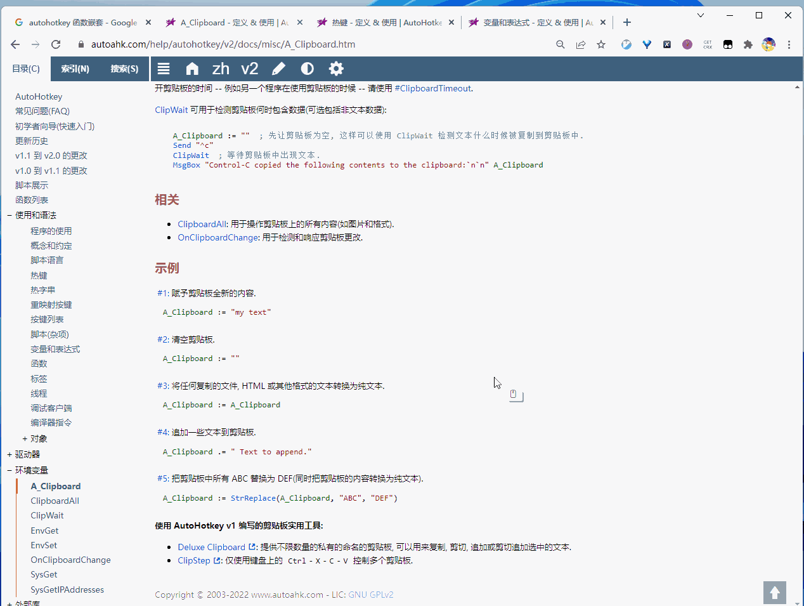

# 鼠标控制

<kbd>Caps</kbd> + <kbd>Win</kbd> + <kbd>A</kbd> 或者 猴子输入法 <kbd>;</kbd> `mm` （即 mouse move ，可以松手了），开启禅模式：

此时轻敲 <kbd>第二个键</kbd>，控制光标动作。

- <kbd>H</kbd> <kbd>J</kbd> <kbd>K</kbd> <kbd>L</kbd> 控制方向（Vim）
  - 同时按住不放 <kbd>A</kbd> 键，能降低鼠标移动速度
- <kbd>I</kbd> / <kbd>O</kbd> 单击左 / 右
- <kbd>U</kbd> / <kbd>P</kbd> 滚轮前 / 后
- <kbd>N</kbd> / <kbd>M</kbd> 侧键前 / 后
- <kbd>C</kbd> / <kbd>V</kbd> 复制/粘贴 选中文字
- <kbd>G</kbd> 指针回到窗口中央
