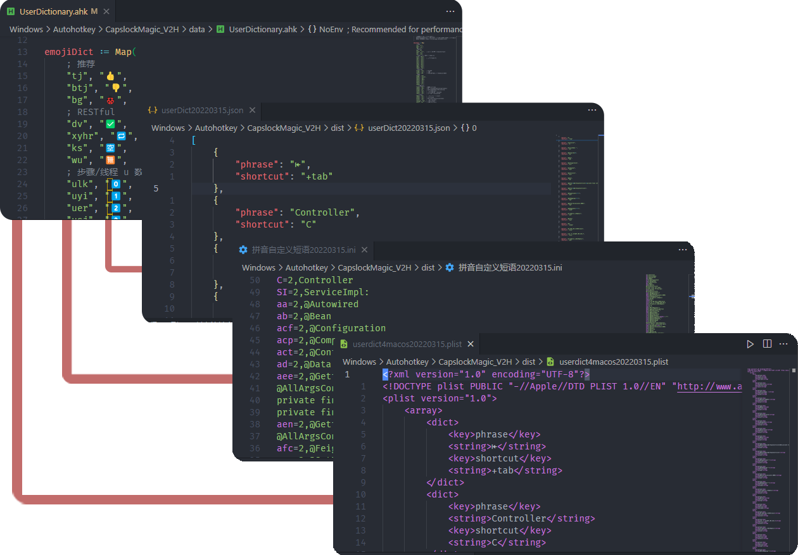
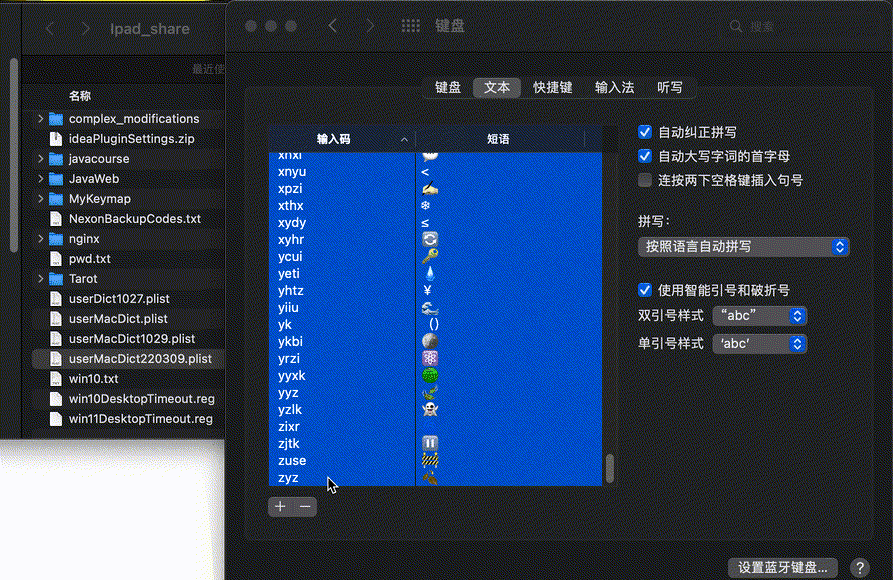

# 如何将猴子词典（.ahk）导出到第三方输入法，比如苹果词典（.plist）?

> 目前已支持 MacOS、QQ拼音、搜狗拼音相互转换



根据需要调用 `Converter` 类的转换方法，获得用户自定义短语文件 ，通过局域网/蓝牙/微信等方式传输，导入输入法软件即可。

1. 打开猴子词典 `./data/UserDictionary.ahk` ，在底部根据自身需要去掉注释，保存后按 <kbd>Caps</kbd> <kbd>Y</kbd> 重启脚本。

```autohotkey

;选择性注释，开放转换接口
global macDictionary := UserDict.concat([emojiDict, csDict, privateDict, logoDict])

CapsLock & 9::
{
    ;猴子词典 -> 苹果词典（枚举类参数可选 MAC / PINYIN / JSON）
    Converter.convert(macDictionary, DictTypeEnum.MAC)

    ;猴子词典 < -苹果词典（弹窗选择文件）
    ;Converter.parse()

    ;猴子词典 < -苹果词典（文件目录） 
    ; fileDir := "/dist/userdict4macos.plist"
    ; Converter.parse(fileDir)

}

```

2. 按 <kbd>Caps</kbd> <kbd>9</kbd> ，根据弹窗提示操作后，点击确定，脚本所在目录就生成了文件 `/dist/userdict4macos.plist` ，通过局域网共享文件传输到 MacOS。


3. MacOS 拖拽用户词典到文本



偏好设置 > 键盘 > 文本

一般先全选删除旧词典，再将成品文件 `.plist` 拖拽进来， 导入内置中文输入法，和平时打字没有区别，只是多了候选项， 润物细无声。

没有切换输入法，也可以自动补全（但在 IDE 中却失效了）。
