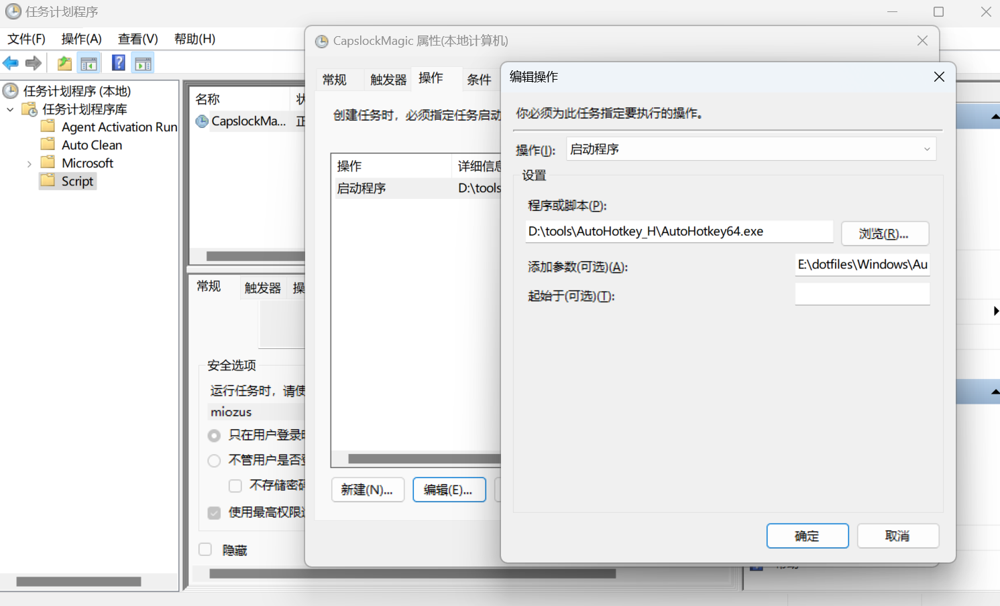
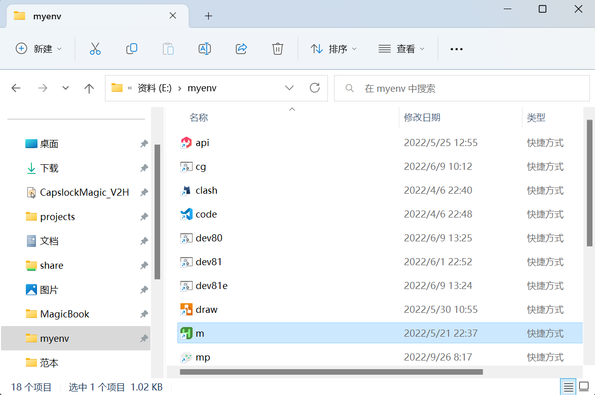

# 快速上手 Windows 版

#### 1.下载

```bash
git clone https://github.com/miozus/CapslockMagic.git
```

#### 2.运行

1. 解压文件: `tools/AutoHotkey_H/AutoHotkey_H-xx-thqby.7z`
   ，或者 [thqby/AutoHotkey_H](https://github.com/thqby/AutoHotkey_H/releases) 版本中心下载最新发行版和解压。
2. 添加管理员权限：右键单击 `AutoHotKey.exe` （x64 / x32）> 属性 > 安全 > 兼容性 > 勾选管理员权限 > 确定。
3. 设置默认打开方式：右键单击 `CapslockMagic.ahk` : 打开方式，选择到步骤1的解压目录的 `AutoHotKey.exe` 打开。

<details>
<summary> 【推荐】开机自启</summary>
&nbsp;

创建基本任务：按 <kbd>Win</kbd> 键搜索 `task` > 任务计划程序 > 右键单击任务计划程序库，新建文件夹 > 新建基本任务 > (按引导设置) > 完成

- 常规：必选使用最高权限运行
- 触发器：登陆时
- 条件：取消勾选所有
- 操作：启动程序 `AutoHotKey.exe`, 参数 `CapslockMagic.ahk` 文件地址



</details>

<details>
<summary>【可选】快速启动小技巧</summary>
&nbsp;

1. 新建文件夹 `myenv` 
2. 右键点击`CapslockMagic.ahk` 创建快捷方式，剪切放入 `myenv` 文件夹中（重命名为`m`）
3. 将 `myenv` 文件夹完整路径，添加到系统环境变量 PATH。
4. 即实现 <kbd> Win</kbd> + <kbd>E</kbd> 输入 `m` 回车，瞬间启动。



</details>
